# terraform concepts from starting 
# steps #
step-1 create folder in github
step-2 clone in to vscode throuh gitbash
step-3 create provider 
step-4 configure aws in gitbash (acess key and screate key)
step-5 then initialize the terraform through command (terraform init) #this means initializing the aws related provider 

# terraform concept
-->terraform follows hashicorp configuration langugage
everything is in flowerbraces {

    key = vaule
}

-->everything is called as resources in terraform (resources means what you are creating in terraform ) exp: ec2 , security group etc...
example:syntax
   resources "type-of-resource" "name-you-provide"
   exp: resource "aws-instances" "roboshop" {

   }
--> indentation is not a matter 
--> you can issue terraform commands where you have .tf files 
# ==========variables===========
dry principle, use it where ever you want 
A variable is a name that holds a value — like a container that stores data.

# ===========terraform.tfvars================
-->terraform.tfvars also works like same variables but terraform gives first priference to terraform.tfvars 
-->terraform.tfvars is used to define variable values in Terraform, and Terraform gives first preference to values in terraform.tfvars over other variable files or default values.
If a variable is defined in multiple places, the value in terraform.tfvars will be used.
# ====================command line variables =====================
--->command line variables means giving variables in the command line 
example : terraform plan -var "sg_name=cmd-allow-all
-->comparing to terraform.tfvars, commandline has more preference for variables 
# ============difference between variables.tf,terraform.tfvars & commandline=================
Here’s the difference between variable files, terraform.tfvars, and command line variables in Terraform:

# 1. Variable File (variables.tf)
Purpose: Defines variable types, names, and default values.
Example:variable "instance_type" {
  type    = string
  default = "t2.micro"
}
Note: Does not set the value (unless you use default). It just declares the variable.
# 2. terraform.tfvars
Purpose: Assigns values to variables declared in variables.tf.
Example:instance_type = "t2.large"
Note: Terraform automatically loads this file and gives it higher priority than defaults.
# 3. Command Line Variables
Purpose: Override variable values directly from the command line.
Example:terraform plan -var "instance_type=t3.medium"
Note: Highest priority—values given here override both terraform.tfvars and defaults.
Summary:

# variables.tf → declares variables
# terraform.tfvars → sets values for variables
# Command line (-var) → overrides all other values
# env variables TF_VAR_<variable-name>
Priority order:
1 Command line > 2 terraform.tfvars > 3 env variables > 4 defaults in variables.tf > 5 user prompt

# ============condictions======================
if(expression){
	these statements if expression is true
}
else{
	these statements if expression is false
}

expression ? "this value if true" : "this will run if false" # this type of condictions are used in terraform 
example syntax: instance_type = var.environment =="dev" ? "t3.micro" : "t3.small"
# ===============loops===================================
1. count based loops  --> good for list 
2. for loops ---> good for map 
3. dynamic block

you can write count of resources you require under the resource definition
+98/
# ===============output.tf================
In Terraform, an output is used to display or store the values of resources after execution — typically after a successful terraform apply.

It helps you extract important information from your infrastructure — for example, instance IDs, IP addresses, or DNS names — so you can use them later or reference them in other modules.
# =====================interpolation======================
using variables and string together exp: "${}-hello"
# ===============indentation maintaining tool=============
terraform fmt is used to maintain the proper indentation in vscode
# ================dynamic blocks==========================
A dynamic block in Terraform helps you create several similar sections inside a resource automatically.
Instead of writing each block by hand, you use a dynamic block to repeat it for each item in a list.
This makes your code shorter and easier to manage.
# =====================functions =============================
we cannot create the our own functions, we have use prebuilt functions 
functions wil take some input and it will give some desired output
# =======================data sources===========================
data sources will fetch the info from provider 
so everytime it will get the updatad details of ami, vpc, or security groupids 
data source also will quary the info from provider 
# ====================locals============================
locals can have expressions, you can assigne a name to it and use it whenever you require
locals are like variables holding values against keys, but you can refer variables inside locals, expressions, functions..
variables can be overridden, locals can't be overridden
# why should we use locals in terraform
-->Make code easier to read by giving names to complex expressions.
-->Avoid repeating the same value or calculation in multiple places.
-->Simplify updates—change the value in one place instead of many.
-->Organize and clean up your configuration.
# =================state=============================
IaaC --> declarative way of creating infra, whatever you declare IaaC tool should create provided you follow right syntax

.tf files --> desired/declared infra --> expectation
what exists in AWS --> actual infra --> reality

state files --> terraform use this file to track what it created in provider

# when we do terraform plan, terraform will read
==================
reads .tf files --> understand what user wants
read state file --> empty
query the provider --> already infra exists or not

it starts create

created infra

# some times when we delete infra manually and we  do terraform plan, what happens is 
reads .tf files, state file --> matched

I deleted instance in console manually
reads .tf files, state file --> matched
it checks provider to verify desired infra vs actual infra 
if it is not matched it will create the deleted one again 

# when you change .tf code # senirio here i deleted the r53 code 
=======================
.tf files --> understands what user wants
state file --> not matched

actual infra --> user don't want r53 records.

terraform uses state file to track what it is created in the provider, every time we run terraform commands terraform check whether desired infra is matching actual infra through state file...
--> terraform itself create the lock to the statefile when it changing or updateing the statefile and relise when it finish
--> terraform will check the provider and .tf file and statefile every single time 
# ==========what is terraform statefile=========================
The Terraform state file keeps a record of everything Terraform has created in your infrastructure —
like EC2 instances, VPCs, S3 buckets, etc.

It’s basically Terraform’s memory of your real-world infrastructure.
# Where It’s Stored:
By default: in your working directory as a file called terraform.tfstate
my-project/
├── main.tf
├── variables.tf
├── outputs.tf
└── terraform.tfstate  ← this file 
# What It Contains:
--> The state file is in JSON format and includes:
--> Resource names and types
--> Their current attributes (like IDs, IPs, etc.)
--> Dependencies between resources
Example (simplified):
{
  "resources": [
    {
      "type": "aws_instance",
      "name": "web",
      "instances": [
        {
          "attributes": {
            "id": "i-0abcd1234ef567890",
            "public_ip": "54.23.89.101"
          }
        }
      ]
    }
  ]
}

Terraform uses this to compare what’s already created vs. what’s defined in your .tf files.
# Why It’s Needed:
When you run:
terraform plan

Terraform:
--> Reads the state file
--> Reads your .tf configuration
--> Compares them
--> Decides what to add / change / destroy
--> Without the state file, Terraform wouldn’t know what’s already built.

# ===== why should we keep statefile in the remote======================
keeping state file in local will not work in collobarative environment. terraform does not understand what were the resources created by others, so it may create duplicate resources or else errors. so better to maintain the statefile in remote state like s3 buckets with locking

# Remote State (for teams):
If multiple people or automation tools use Terraform, it’s best to store the state remotely (e.g. in S3 with DynamoDB locking):

Example:
terraform {
  backend "s3" {
    bucket         = "my-terraform-state"
    key            = "prod/terraform.tfstate"
    region         = "us-east-1"
    dynamodb_table = "terraform-lock"
  }
}
This keeps it safe and prevents two people from changing resources at the same time.
# we need to to lock the backend file in remotestate because===
We need a lock for backend to prevent multiple people or processes from changing the Terraform state file at the same time.
Locking avoids conflicts and corruption, making sure only one operation updates the state at once. This keeps your infrastructure safe and consistent.
# ============changing the statefile is good or bad ?=============
we should not do any changes in the statefile, terraform will takecare of the statefile, which is not our responsiblity 
# Important Notes:
--> Never edit terraform.tfstate manually unless you really know what you’re doing.
--> Don’t share it publicly — it can contain sensitive data (like passwords, IPs, access keys).
--> Use remote backends for real projects.
# ================big note about provider =======================
if we do any changes in the provider we have to do the reconfigure
# added backend remote state in provider 
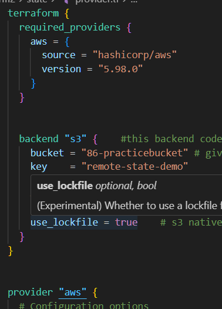 
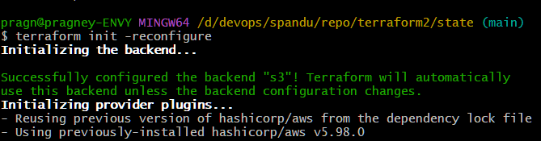
# ========provisioners============
when you create the server using terraform, we can take some actions using provisioners
1. local-exec
2. remote-exec

where I run terraform command, that is local to terraform
remote means server I created using terraform

# local-exec
--> local-exec means running commands or scripts on your own computer (where you run Terraform), not on the remote server.
For example, you can use it to print messages, copy files, or run scripts locally during Terraform apply.
# example how to use local provisioners 
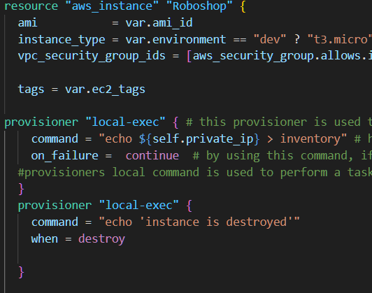 
# remote-exec
In Terraform, remote-exec is a provisioner that allows you to run commands on a remote machine (like an EC2 instance) after it has been created.
--> it connects by using SSH and by giving user name and password
# Simple Definition of remote-exec
remote-exec = runs shell commands inside the created resource (like a VM) over SSH or WinRM.
So, once Terraform finishes creating your server, it can automatically connect to it and run setup commands — such as installing packages, configuring files, or starting services.
# example how to use remote-exec provisioners
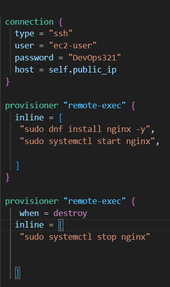
# sample output of remote server connects 
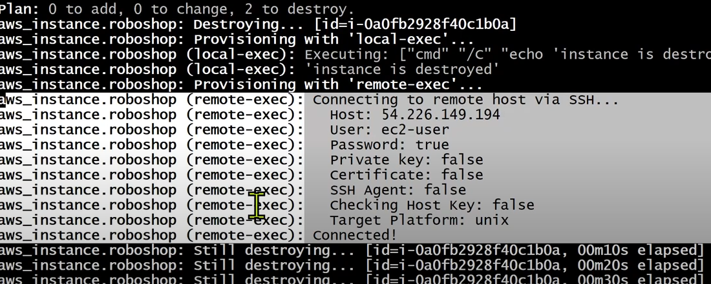

# we can mention the provisoners when should be it executed, in terraform we have 2 type 
# 1.creation time provisioners
--> Creation-time provisioners run automatically when you apply your Terraform code and the resource is created. 
--> Creation-time execution means the provisioner runs automatically when the resource is first created by Terraform.
So, when you apply your Terraform code and the resource is built, any creation-time provisioners will execute by default.
# 2.destory time provisioners
--> Destroy-time provisioners run when Terraform deletes a resource.
They let you run cleanup commands or scripts just before the resource is removed.
For example, you can use them to delete files, remove users, or notify other systems before the resource is gone.
# example usecase
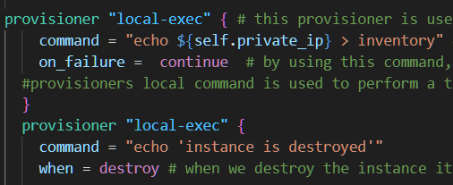
# ==note for when = destroy
--> By giving when = destroy in provisioners, the provisioner will run before the resource is destroyed, not after.
It lets you run cleanup actions just before Terraform deletes the resource.
# how to create multiple infrastructure by using terraform 
we can create multiple infrastructure by using terraform.tfvars
exp: dev, prod, testing
# what is terraform.tfvars
terraform.tfvars is a special Terraform file used to store variable values separately from your main configuration files.
it will override the default values through terraform.tfvars
⚙️ How It Works
first keep providers in remotestate and we should create the seperate folders for dev and prod & also create seperate buckets in aws s3 for dev & prod
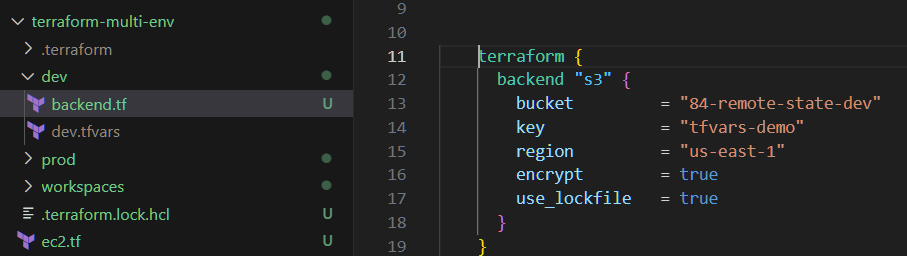
Step 1️⃣ — Define variables in variables.tf
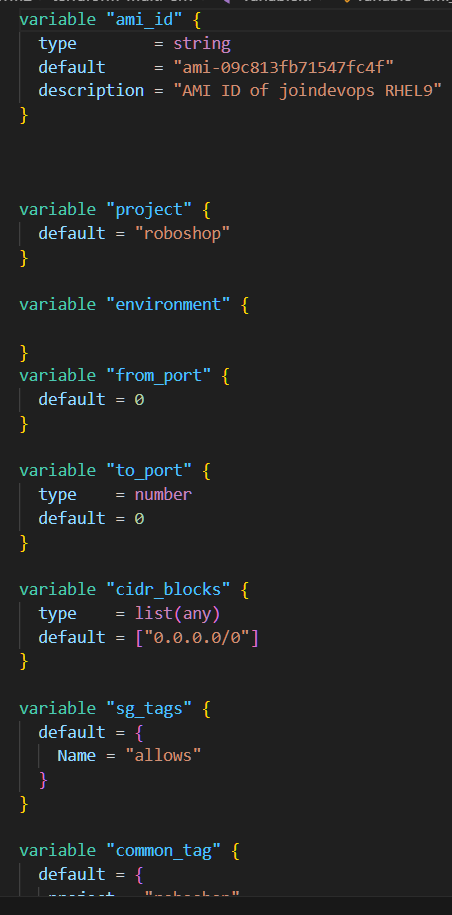
Step 2️⃣ — Assign values in terraform.tfvars
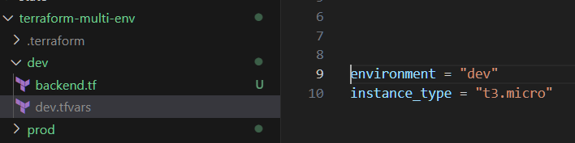
Step 3️⃣ — Use variables in your main configuration (main.tf)
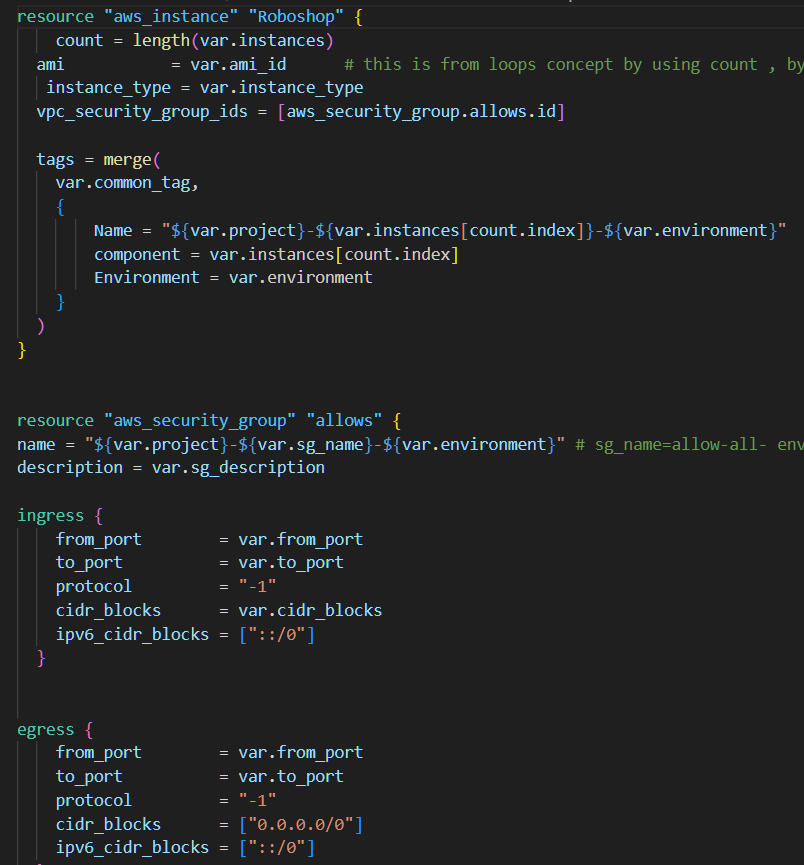
in general terraform.tfvars means it overrides the default variables in variable.tf file 
so when comming to the creating the multi-environment means here we are using the terraform.tfvars, in multi-env we create seperate folders for dev and prod & in that we create seperate backend.tf and .tfvars and we provide dev related info in dev folder and prod related info in prod folder & and comman related info we provide in variable.tf, so here which is not common we are giving in related folder so we run the dev or prod folder, use below commands 
# note : We put environment-specific values in terraform.tfvars, not in variables.tf.
If we add values for multiple environments in variables.tf, it can cause errors.
exp:environment = "dev"
instance_type = "t3.micro"
first reconfigure the backand by using the below provided image command (command is provide in the image)

then next run terraform play command 
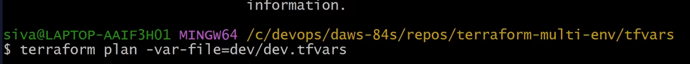
next run terraformapply
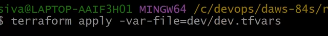

# in simple term about terraform.tfvars
In general, terraform.tfvars is used to override the default values defined in the variables.tf file.

When it comes to multi-environment setups (like development and production), we usually create separate folders for each environment — for example, a dev folder and a prod folder.

Inside each environment folder, we create separate files such as backend.tf and terraform.tfvars.

The backend.tf file contains backend configuration (like the S3 bucket or remote state details).

The terraform.tfvars file stores environment-specific variable values — for example, region, instance type, or tags for that environment.

Common or shared configurations (such as variable definitions) are placed in the main variables.tf file at the root level.
Then, each environment folder only includes the non-common or environment-specific values.
# pros
no need to duplicate the code 
consistancy
# cons
should be very cautions changes done in dev may go to prod also by mistake 
# if we want to use this terraform.tfvars we shuld need full calirity what we are doing and where we are working 
# it is good for samll projects not for big projects 
# ==========workspaces===================
A Terraform workspace is a separate working environment within the same Terraform configuration.
Each workspace has its own state file, which means it keeps track of its own set of resources.

So — you can use one configuration to manage multiple environments (like dev, stage, prod) without creating multiple folders.
# Default Behavior
By default, Terraform starts with a workspace called default.
All your state and resources go there unless you create new ones.
Example

# Let’s say you have this configuration:
resource "aws_instance" "web" {
  ami           = "ami-0c55b159cbfafe1f0"
  instance_type = "t2.micro"
  tags = {
    Name = "web-${terraform.workspace}"
  }
}
# Now, run these commands 👇
terraform workspace new dev
terraform apply
This will create an instance named web-dev.

# Then switch to prod:

terraform workspace new prod
terraform apply
This time it creates a different instance, named web-prod — because each workspace has its own state file.

# 🧭 Useful Commands
Command	Description
terraform workspace list	Lists all workspaces
terraform workspace new <name>	Creates a new workspace
terraform workspace select <name>	Switches to an existing workspace
terraform workspace show	Shows the current workspace
terraform workspace delete <name>	Deletes a workspace (if empty)

# 🧩 Tip:

Workspaces are good for small setups.
Folder-based structure is better for large projects with different configurations or backends.

# ✅ Summary
Feature	Description
Purpose	Manage multiple environments using one configuration
Each workspace has	Its own Terraform state file
Default workspace	default
Common use case	dev, stage, prod environments
Terraform variable	${terraform.workspace} to identify environment

# what is difference between terraform.tfvars and workspaces?
Both terraform.tfvars and workspaces are used for managing multiple environments (like dev, test, prod) —
but they do it in different ways.
# ⚙️ 1️⃣ terraform.tfvars → Defines variable values
--> It’s a file that stores values for variables.
--> Commonly used to separate environment-specific configurations.
📁 Example:
variables.tf         → defines variables
terraform.tfvars     → assigns values
dev.tfvars           → dev-specific values
prod.tfvars          → prod-specific values
You can apply a specific environment by running:
terraform apply -var-file="dev.tfvars"
# ✅ Purpose:
Use different .tfvars files for each environment.
Terraform still runs in the same workspace, but uses different variable values.
# ⚙️ 2️⃣ Workspaces → Separate state files
A workspace is a separate Terraform state environment under the same configuration.
Each workspace has its own state file, meaning its own set of resources.
📁 Example:
terraform workspace new dev
terraform apply
terraform workspace new prod
terraform apply
Terraform will create two different sets of infrastructure — one for dev and one for prod — using the same configuration.

✅ Purpose:
Use a single configuration file but maintain different states for each environment.

# 🧩 In Simple Words

terraform.tfvars → controls input values (like region, size, name).

Workspace → controls which set of infrastructure (state) you’re working on.
# Pro Tip
You can combine both:
Use workspaces to separate environments (different state files).
Use tfvars files to customize each environment’s variables.
terraform workspace select dev
terraform apply -var-file="dev.tfvars"

 