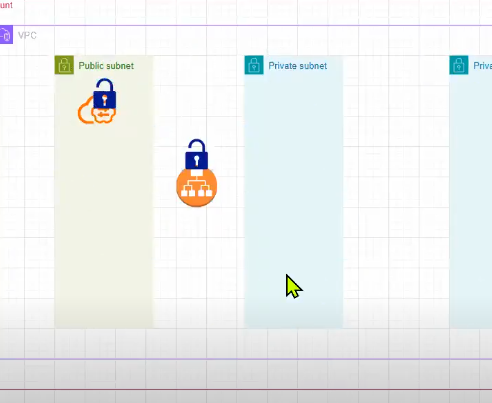

# terraform concepts from starting 
# steps #
step-1 create folder in github
step-2 clone in to vscode throuh gitbash
step-3 create provider 
step-4 configure aws in gitbash (acess key and screate key)
step-5 then initialize the terraform through command (terraform init) #this means initializing the aws related provider 

# terraform concept
-->terraform follows hashicorp configuration langugage
everything is in flowerbraces {

    key = vaule
}

-->everything is called as resources in terraform (resources means what you are creating in terraform ) exp: ec2 , security group etc...
example:syntax
   resources "type-of-resource" "name-you-provide"
   exp: resource "aws-instances" "roboshop" {

   }
--> indentation is not a matter 
--> you can issue terraform commands where you have .tf files 
# ==========variables===========
dry principle, use it where ever you want 
A variable is a name that holds a value — like a container that stores data.

# ===========terraform.tfvars================
-->terraform.tfvars also works like same variables but terraform gives first priference to terraform.tfvars 
-->terraform.tfvars is used to define variable values in Terraform, and Terraform gives first preference to values in terraform.tfvars over other variable files or default values.
If a variable is defined in multiple places, the value in terraform.tfvars will be used.
# ====================command line variables =====================
--->command line variables means giving variables in the command line 
example : terraform plan -var "sg_name=cmd-allow-all
-->comparing to terraform.tfvars, commandline has more preference for variables 
# ============difference between variables.tf,terraform.tfvars & commandline=================
Here’s the difference between variable files, terraform.tfvars, and command line variables in Terraform:

# 1. Variable File (variables.tf)
Purpose: Defines variable types, names, and default values.
Example:variable "instance_type" {
  type    = string
  default = "t2.micro"
}
Note: Does not set the value (unless you use default). It just declares the variable.
# 2. terraform.tfvars
Purpose: Assigns values to variables declared in variables.tf.
Example:instance_type = "t2.large"
Note: Terraform automatically loads this file and gives it higher priority than defaults.
# 3. Command Line Variables
Purpose: Override variable values directly from the command line.
Example:terraform plan -var "instance_type=t3.medium"
Note: Highest priority—values given here override both terraform.tfvars and defaults.
Summary:

# variables.tf → declares variables
# terraform.tfvars → sets values for variables
# Command line (-var) → overrides all other values
# env variables TF_VAR_<variable-name>
Priority order:
1 Command line > 2 terraform.tfvars > 3 env variables > 4 defaults in variables.tf > 5 user prompt

# ============condictions======================
if(expression){
	these statements if expression is true
}
else{
	these statements if expression is false
}

expression ? "this value if true" : "this will run if false" # this type of condictions are used in terraform 
example syntax: instance_type = var.environment =="dev" ? "t3.micro" : "t3.small"
# ===============loops===================================
1. count based loops  --> good for list 
2. for loops ---> good for map 
3. dynamic block

you can write count of resources you require under the resource definition
+98/
# ===============output.tf================
In Terraform, an output is used to display or store the values of resources after execution — typically after a successful terraform apply.

It helps you extract important information from your infrastructure — for example, instance IDs, IP addresses, or DNS names — so you can use them later or reference them in other modules.
# =====================interpolation======================
using variables and string together exp: "${}-hello"
# ===============indentation maintaining tool=============
terraform fmt is used to maintain the proper indentation in vscode
# ================dynamic blocks==========================
A dynamic block in Terraform helps you create several similar sections inside a resource automatically.
Instead of writing each block by hand, you use a dynamic block to repeat it for each item in a list.
This makes your code shorter and easier to manage.
# =====================functions =============================
we cannot create the our own functions, we have use prebuilt functions 
functions wil take some input and it will give some desired output
# =======================data sources===========================
data sources will fetch the info from provider(aws) 
so everytime it will get the updatad details of ami, vpc, or security groupids 
data source also will quary the info from provider 
# ====================locals============================
locals can have expressions, you can assigne a name to it and use it whenever you require
locals are like variables holding values against keys, but you can refer variables inside locals, expressions, functions..
variables can be overridden, locals can't be overridden
# why should we use locals in terraform
-->Make code easier to read by giving names to complex expressions.
-->Avoid repeating the same value or calculation in multiple places.
-->Simplify updates—change the value in one place instead of many.
-->Organize and clean up your configuration.
# =================state=============================
IaaC --> declarative way of creating infra, whatever you declare IaaC tool should create provided you follow right syntax

.tf files --> desired/declared infra --> expectation
what exists in AWS --> actual infra --> reality

state files --> terraform use this file to track what it created in provider

# when we do terraform plan, terraform will read
==================
reads .tf files --> understand what user wants
read state file --> empty
query the provider --> already infra exists or not

it starts create

created infra

# some times when we delete infra manually and we  do terraform plan, what happens is 
reads .tf files, state file --> matched

I deleted instance in console manually
reads .tf files, state file --> matched
it checks provider to verify desired infra vs actual infra 
if it is not matched it will create the deleted one again 

# when you change .tf code # senirio here i deleted the r53 code 
=======================
.tf files --> understands what user wants
state file --> not matched

actual infra --> user don't want r53 records.

terraform uses state file to track what it is created in the provider, every time we run terraform commands terraform check whether desired infra is matching actual infra through state file...
--> terraform itself create the lock to the statefile when it changing or updateing the statefile and relise when it finish
--> terraform will check the provider and .tf file and statefile every single time 
# ==========what is terraform statefile=========================
The Terraform state file keeps a record of everything Terraform has created in your infrastructure —
like EC2 instances, VPCs, S3 buckets, etc.

It’s basically Terraform’s memory of your real-world infrastructure.
# Where It’s Stored:
By default: in your working directory as a file called terraform.tfstate
my-project/
├── main.tf
├── variables.tf
├── outputs.tf
└── terraform.tfstate  ← this file 
# What It Contains:
--> The state file is in JSON format and includes:
--> Resource names and types
--> Their current attributes (like IDs, IPs, etc.)
--> Dependencies between resources
Example (simplified):
{
  "resources": [
    {
      "type": "aws_instance",
      "name": "web",
      "instances": [
        {
          "attributes": {
            "id": "i-0abcd1234ef567890",
            "public_ip": "54.23.89.101"
          }
        }
      ]
    }
  ]
}

Terraform uses this to compare what’s already created vs. what’s defined in your .tf files.
# Why It’s Needed:
When you run:
terraform plan

Terraform:
--> Reads the state file
--> Reads your .tf configuration
--> Compares them
--> Decides what to add / change / destroy
--> Without the state file, Terraform wouldn’t know what’s already built.

# ===== why should we keep statefile in the remote======================
keeping state file in local will not work in collobarative environment. terraform does not understand what were the resources created by others, so it may create duplicate resources or else errors. so better to maintain the statefile in remote state like s3 buckets with locking

# Remote State (for teams):
If multiple people or automation tools use Terraform, it’s best to store the state remotely (e.g. in S3 with DynamoDB locking):

Example:
terraform {
  backend "s3" {
    bucket         = "my-terraform-state"
    key            = "prod/terraform.tfstate"
    region         = "us-east-1"
    dynamodb_table = "terraform-lock"
  }
}
This keeps it safe and prevents two people from changing resources at the same time.
# we need to to lock the backend file in remotestate because===
We need a lock for backend to prevent multiple people or processes from changing the Terraform state file at the same time.
Locking avoids conflicts and corruption, making sure only one operation updates the state at once. This keeps your infrastructure safe and consistent.
# ============changing the statefile is good or bad ?=============
we should not do any changes in the statefile, terraform will takecare of the statefile, which is not our responsiblity 
# Important Notes:
--> Never edit terraform.tfstate manually unless you really know what you’re doing.
--> Don’t share it publicly — it can contain sensitive data (like passwords, IPs, access keys).
--> Use remote backends for real projects.
# ================big note about provider =======================
if we do any changes in the provider we have to do the reconfigure
# added backend remote state in provider 
 

# ========provisioners============
when you create the server using terraform, we can take some actions using provisioners
1. local-exec
2. remote-exec

where I run terraform command, that is local to terraform
remote means server I created using terraform

# local-exec
--> local-exec means running commands or scripts on your own computer (where you run Terraform), not on the remote server.
For example, you can use it to print messages, copy files, or run scripts locally during Terraform apply.
# example how to use local provisioners 
 
# remote-exec
In Terraform, remote-exec is a provisioner that allows you to run commands on a remote machine (like an EC2 instance) after it has been created.
--> it connects by using SSH and by giving user name and password
# Simple Definition of remote-exec
remote-exec = runs shell commands inside the created resource (like a VM) over SSH or WinRM.
So, once Terraform finishes creating your server, it can automatically connect to it and run setup commands — such as installing packages, configuring files, or starting services.
# example how to use remote-exec provisioners

# sample output of remote server connects 

# we can mention the provisoners when should be it executed, in terraform we have 2 type 
# 1.creation time provisioners
--> Creation-time provisioners run automatically when you apply your Terraform code and the resource is created. 
--> Creation-time execution means the provisioner runs automatically when the resource is first created by Terraform.
So, when you apply your Terraform code and the resource is built, any creation-time provisioners will execute by default.
# 2.destory time provisioners
--> Destroy-time provisioners run when Terraform deletes a resource.
They let you run cleanup commands or scripts just before the resource is removed.
For example, you can use them to delete files, remove users, or notify other systems before the resource is gone.
# example usecase

# ==note for when = destroy
--> By giving when = destroy in provisioners, the provisioner will run before the resource is destroyed, not after.
It lets you run cleanup actions just before Terraform deletes the resource.
# how to create multiple infrastructure by using terraform 
we can create multiple infrastructure by using terraform.tfvars
exp: dev, prod, testing
# what is terraform.tfvars
terraform.tfvars is a special Terraform file used to store variable values separately from your main configuration files.
it will override the default values through terraform.tfvars
⚙️ How It Works
first keep providers in remotestate and we should create the seperate folders for dev and prod & also create seperate buckets in aws s3 for dev & prod

Step 1️⃣ — Define variables in variables.tf

Step 2️⃣ — Assign values in terraform.tfvars

Step 3️⃣ — Use variables in your main configuration (main.tf)

in general terraform.tfvars means it overrides the default variables in variable.tf file 
so when comming to the creating the multi-environment means here we are using the terraform.tfvars, in multi-env we create seperate folders for dev and prod & in that we create seperate backend.tf and .tfvars and we provide dev related info in dev folder and prod related info in prod folder & and comman related info we provide in variable.tf, so here which is not common we are giving in related folder so we run the dev or prod folder, use below commands 
# note : We put environment-specific values in terraform.tfvars, not in variables.tf.
If we add values for multiple environments in variables.tf, it can cause errors.
exp:environment = "dev"
instance_type = "t3.micro"
first reconfigure the backand by using the below provided image command (command is provide in the image)

then next run terraform play command 

next run terraformapply

# in simple term about terraform.tfvars
In general, terraform.tfvars is used to override the default values defined in the variables.tf file.

When it comes to multi-environment setups (like development and production), we usually create separate folders for each environment — for example, a dev folder and a prod folder.

Inside each environment folder, we create separate files such as backend.tf and terraform.tfvars.

The backend.tf file contains backend configuration (like the S3 bucket or remote state details).

The terraform.tfvars file stores environment-specific variable values — for example, region, instance type, or tags for that environment.

Common or shared configurations (such as variable definitions) are placed in the main variables.tf file at the root level.
Then, each environment folder only includes the non-common or environment-specific values.
# pros
no need to duplicate the code 
consistancy
# cons
should be very cautions changes done in dev may go to prod also by mistake 
# if we want to use this terraform.tfvars we shuld need full calirity what we are doing and where we are working 
# it is good for samll projects not for big projects 
# ==========workspaces===================

A Terraform workspace is a separate working environment within the same Terraform configuration.
Each workspace has its own state file, which means it keeps track of its own set of resources.

So — you can use one configuration to manage multiple environments (like dev, stage, prod) without creating multiple folders.
here terraform will seperate variable for workspace 
terraform.workspace =dev or prod 
if we want dev use terraform.workspace.dev
if we want prod use terraform.workspace.prod
1) to get workspace commands in terraform 

# Default Behavior
By default, Terraform starts with a workspace called default.
All your state and resources go there unless you create new ones.
# Now About the “Default” Workspace

When you first initialize a Terraform project (terraform init),
Terraform automatically creates a workspace called default.

👉 So before you explicitly create or switch to any new workspace (like dev, prod, etc.),
Terraform uses the default workspace by default.
Example

1️⃣ You start in your Terraform folder

terraform init
terraform plan
terraform apply

You didn’t create any workspace — so it uses:

🏠 Workspace: default

Terraform’s state file (terraform.tfstate) belongs to this default workspace.

2️⃣ Later, you decide to create a new one:

terraform workspace new dev

Now a new workspace is created (with its own state file).

If you run:

terraform workspace list

You’ll see:

default
* dev

The asterisk * shows your current workspace.

💡 So your understanding:

“Before creating a workspace, Terraform stores everything in the default workspace.”

# errors in workspace
1) if you create the dev workspace earlier and again if create with same name exp: dev it will throw error

so create with different name 
2) if you create the prod and you did'nt mention any value in the variable then you get error to overcome this we can give the default value 

# 🧭 Useful Commands for workspace
Command	Description
terraform workspace list	Lists all workspaces
terraform workspace new <name>	Creates a new workspace
terraform workspace select <name>	Switches to an existing workspace
terraform workspace show	Shows the current workspace
terraform workspace delete <name>	Deletes a workspace (if empty)

# 🧩 Tip:

Workspaces are good for small setups.
Folder-based structure is better for large projects with different configurations or backends.

# ✅ Summary
Feature	Description
Purpose	Manage multiple environments using one configuration
Each workspace has	Its own Terraform state file
Default workspace	default
Common use case	dev, stage, prod environments
Terraform variable	${terraform.workspace} to identify environment

# how workspace maintain seperate statefile in remote state

here in workspace everything is handeled by terraform 

# # ==what is difference between terraform.tfvars and workspaces?
Both terraform.tfvars and workspaces are used for managing multiple environments (like dev, test, prod) —
but they do it in different ways.
# ⚙️ 1️⃣ terraform.tfvars → Defines variable values
--> It’s a file that stores values for variables.
--> Commonly used to separate environment-specific configurations.
📁 Example:
variables.tf         → defines variables
terraform.tfvars     → assigns values
dev.tfvars           → dev-specific values
prod.tfvars          → prod-specific values
You can apply a specific environment by running:
terraform apply -var-file="dev.tfvars"
# ✅ Purpose:
Use different .tfvars files for each environment.
Terraform still runs in the same workspace, but uses different variable values.
# ⚙️ 2️⃣ Workspaces → Separate state files
A workspace is a separate Terraform state environment under the same configuration.
Each workspace has its own state file, meaning its own set of resources.
📁 Example:
terraform workspace new dev
terraform apply
terraform workspace new prod
terraform apply
Terraform will create two different sets of infrastructure — one for dev and one for prod — using the same configuration.

✅ Purpose:
Use a single configuration file but maintain different states for each environment.

# 🧩 In Simple Words

terraform.tfvars → controls input values (like region, size, name).

Workspace → controls which set of infrastructure (state) you’re working on.
# Pro Tip
You can combine both:
Use workspaces to separate environments (different state files).
Use tfvars files to customize each environment’s variables.
terraform workspace select dev
terraform apply -var-file="dev.tfvars"
# ==========modules==============
What is a Terraform Module?
--> A module in Terraform is simply a reusable group of Terraform resources.
--> Think of a module like a folder that contains Terraform files (main.tf, variables.tf, outputs.tf) which perform a specific task — such as creating a VPC, EC2 instance, or S3 bucket.

--> and we have some public modules also 
# example of Public Modules

Terraform has a public registry where you can use community-created modules.

👉 Example:
module "vpc" {
  source  = "terraform-aws-modules/vpc/aws"
  version = "5.0.0"

  name = "my-vpc"
  cidr = "10.0.0.0/16"
}
Here, you’re using a ready-made VPC module from Terraform Registry — no need to write the VPC code manually.
# NOTE: when you create the new (or) adding the module in the previos module page you should do terraform init again

# ========== we have 2 types of modules
1. developed on our own customised modules --> created by us 
2. open source modules --> terraform devoloped 

custom modules
===============
pros
=====
1. everything is in our control

cons
=====
1. we need to write lot of code
2. we need to maintain

opensource modules
===============
pros
=====
1. directly use, no need to write and maintain

cons
=====
not in our control
can't fully customise
need to depend on community
we need to follow their documentation 

# ============from here AWS concepts ====================
vpc peering concept
note: if two vpc are in same cidr range it will not work 

# How do we get the module upadates when the platform engineers do changes in the modules?
by using 

 when the platform engineers do changes in modules in the github we get the module updates by using terraform init -upgrade 
 # ===============SSM parameters store ==================
SSM Parameter Store is used to store values like IDs, passwords, API keys, AMI IDs, or configuration data — and it acts as a centralized storage that everyone in the team (or your infrastructure) can securely access.
# Think of it like this:

Instead of writing secrets or values directly in:

Terraform code

Ansible playbooks

EC2 user data

or environment variables

You put them once in SSM Parameter Store — and any AWS service or team member (with permission) can fetch them safely.

# 🧩 Example:

Let’s say your team is working on multiple Terraform modules:

Module A creates EC2 instances

Module B creates RDS

Module C creates ECS tasks

Instead of each module hardcoding the database password or VPC ID,
you store them in SSM like:

/project/vpc/id = vpc-12345
/project/db/password = MySecurePass123

Now all modules can read the same values directly from SSM.

# 🔐 Bonus:

You can also control access —
for example, give only the DevOps team permission to view passwords, but developers can only read non-sensitive configs.

 # from here we creating the iaac for roboshop, iaac is same for all projects 
 1) when we are creating the infrastructure for any project first we have to create vpc 
 2) 2nd we need to create the security group 
 3) create the frontend and in the same subnet create the bastionhost also
 4) 

 # ================Bastion host ===================
 # What is a Bastion Host?

A Bastion Host (also called a Jump Server) is a special-purpose EC2 instance that acts as a secure gateway to access private instances (like EC2s in private subnets) inside your VPC.

It’s basically a “jump point” — instead of allowing SSH access to all private instances from the internet, you allow SSH only to the bastion host.
bastion is placed in the public instance

# Why do we need it?

In AWS, for security best practices, your private instances (like database servers, backend apps) shouldn’t have public IPs — so you can’t directly SSH into them.

But sometimes, you still need admin or troubleshooting access.
That’s where the bastion host comes in — it’s your controlled entry point.

Step 1️⃣: Connect to Bastion Host

Bastion Host has a public IP.

Security group allows SSH (port 22) access only from your office/home IP.

Step 2️⃣: From Bastion → Private Instance

Once you SSH into the Bastion, you can SSH into private instances (like the App or DB server).

Those private instances allow SSH only from the bastion host’s private IP (not from the internet).

Step 3️⃣: Done Securely

You’re now securely connected to your private instance through the bastion.

No private instance is ever exposed to the internet. 🔒

# == difference between nat and bastion host ======
# Bastion Host

It’s like a secure entry gate for your private servers.

You manually connect (SSH or RDP) to your private instances through the bastion.

Used by humans (admins/developers) to access private servers for maintenance or troubleshooting.

It doesn’t route normal internet traffic — only remote login.

👉 Example:
You have private EC2 instances with no public IP. You connect first to the bastion (which has a public IP), then from there SSH into the private EC2s.

# 🌐 NAT Gateway / NAT Instance

It’s like a translator that lets private servers access the internet (for updates, package downloads, etc.) — but prevents the internet from accessing them.

Used by servers (not humans).

It only handles outbound traffic from private instances to the internet.

👉 Example:
A private EC2 wants to download software updates from the internet. It goes through the NAT Gateway to do that.

# Bastion Host

Yes, it handles both inbound and outbound traffic —
but mainly inbound SSH/RDP connections from admins.

Inbound → you (admin) connect into the bastion.

Outbound → bastion connects from itself to private instances.

So it’s two-way, but only for management traffic (not general internet use).

# NAT Gateway

It handles only outbound traffic from private instances to the internet.

It does not allow inbound connections from the internet to the private instances.

# =NAT Gateway (Network Address Translation Gateway)

✅ Purpose:
Allows instances in private subnets to access the internet (outgoing traffic only), while still keeping them inaccessible from the internet (no incoming traffic).

👉 Example Use Case:

You have EC2 instances in a private subnet that need to:

Download OS updates

Access external APIs

Reach AWS services (like S3, ECR, etc.)

Those instances can send traffic out to the internet via the NAT Gateway, but no one from outside can directly connect to them.

🚦Traffic Direction:

Outbound: ✅ Allowed

Inbound: ❌ Blocked

# 🧑‍💻 Bastion Host (Jump Server)

✅ Purpose:
Used to securely connect (SSH or RDP) to instances in private subnets from the internet.

It acts as a bridge — you connect to the Bastion Host (which is in a public subnet) first, and from there you connect to private instances.

👉 Example Use Case:

You want to SSH into a private EC2 instance for troubleshooting.

You first SSH into the Bastion Host → then into the private instance.

🚦Traffic Direction:

Inbound: ✅ Allowed (you connect into it)

Outbound: ✅ Allowed (it connects to private instances)

# ✅ Final Correct Statement:

Bastion host handles both inbound (from admin) and outbound (to private instance) traffic for management purposes,
while NAT Gateway handles only outbound traffic from private servers to the internet.
# ====== if i delete statefile how to recover it ? ==========
Let’s go step-by-step so you fully understand what happens when you delete the Terraform state file and how to recover it (or prevent losing it in the first place).

# 🧩 1️⃣ What is the State File?

The terraform.tfstate file is Terraform’s brain 🧠

It keeps track of:

What resources have been created

Their IDs in AWS

Dependencies between resources

Output values

When you run terraform plan or terraform apply, Terraform compares your .tf files with the state file to know:

what to create, update, or delete.

# ⚠️ 2️⃣ What Happens If You Delete It

If you delete terraform.tfstate (and you’re not using a remote backend):

Terraform forgets what it created in AWS.

Your AWS resources (like EC2, VPC, etc.) will still exist, but Terraform will not know about them anymore.

If you run terraform plan again — Terraform will think nothing exists, and may try to create everything again 😬

So it’s a big risk if not backed up.

# 🧯 3️⃣ How to Recover (Depends on Your Setup)
✅ Case 1: You Use Remote Backend (like S3)

If your backend is configured like this:

terraform {
  backend "s3" {
    bucket = "my-tf-state-bucket"
    key    = "vpc/terraform.tfstate"
    region = "us-east-1"
  }
}

Then:

The state file is safely stored in S3, not locally.

Even if you delete your local copy — Terraform will automatically download the remote state when you run any command.

👉 So, if you’re using S3 remote backend, you don’t need to worry — it’s safe.

You can even recover older versions because:

S3 has versioning, so you can restore a previous .tfstate version anytime.

⚠️ Case 2: You Were Using Local State

If you didn’t configure a backend and your terraform.tfstate file was only local:

There’s no automatic recovery (Terraform doesn’t keep a copy).

Your AWS resources still exist — but Terraform doesn’t know about them.

👉 In that case, you can rebuild the state using this command:

🧱 Step 1: Recreate the state manually using
terraform import <resource_type>.<resource_name> <resource_id>

Example:

terraform import aws_instance.web i-0a1234567890abcd
terraform import aws_vpc.main vpc-0a1234567890abcd

This tells Terraform:

“Hey, this resource already exists in AWS — add it back into the state file.”

You’ll have to import each resource you had before.

# 🧰 4️⃣ Best Practice — Always Use Remote Backend

To prevent losing state, always store it remotely:

S3 (for file storage)

DynamoDB (for locking)

Or Terraform Cloud / Backend

Example:

terraform {
  backend "s3" {
    bucket         = "my-terraform-state"
    key            = "envs/dev/terraform.tfstate"
    region         = "us-east-1"
    dynamodb_table = "terraform-lock"
  }
}

This way:

Your state file is safe

You can recover old versions

Multiple team members can work safely

✅ Summary
Scenario	What Happens	How to Recover
Local state deleted	Terraform loses track	Use terraform import for each resource
Remote state (S3)	Safe — automatically synced	Re-download or restore version from S3
Best practice	Always use S3 backend + DynamoDB lock	Prevents loss & conflicts
💡 In Short:

If you delete your local state, you can re-import resources using terraform import.
But the best solution is to always store your state in a remote backend like S3 with versioning enabled.

# ==========loadblancing============

Load balancing is a technique used in computing to distribute incoming network traffic or workloads across multiple servers to ensure no single server gets overwhelmed. This improves performance, reliability, and availability of applications or websites.

Here’s a simple way to understand it:

Imagine a restaurant with one chef. If 50 customers come at the same time, the chef gets overwhelmed, and service slows down.

Now imagine the restaurant has 5 chefs, and the host directs incoming orders evenly among them. Everyone gets served faster, and no chef is overloaded.

# In computing:

Clients → make requests (like customers).

Load Balancer → acts as the host, distributing traffic.

Servers → handle the requests (like chefs).

# Key Points:

   1) Types of Load Balancing:

Round Robin: Requests go to servers in order, one by one.

Least Connections: Requests go to the server with the fewest active connections.

IP Hash: Requests are sent based on the client’s IP address.

  2) Benefits:

Prevents server overload.

Increases availability (if one server fails, traffic can go to others).

Improves performance and response time.

  3) Where it’s used:

Websites with high traffic.

Applications running in the cloud (AWS ELB, Azure Load Balancer).

Databases or APIs handling many requests.

          ┌───────────────┐
          │   Clients     │
          │ (Users/Apps)  │
          └───────┬───────┘
                  │
                  ▼
          ┌───────────────┐
          │ Load Balancer │
          └───────┬───────┘
     ┌─────────────┼─────────────┐
     ▼             ▼             ▼
┌─────────┐   ┌─────────┐   ┌─────────┐
│ Server 1│   │ Server 2│   │ Server 3│
└─────────┘   └─────────┘   └─────────┘
Explanation:

The Load Balancer receives all incoming requests from clients.

It decides which server will handle each request (using round-robin, least connections, etc.).

This ensures no single server is overwhelmed, improving performance and availability.

# ==================target groups ===============
What is a Target Group in AWS?

A Target Group is a collection of targets (EC2 instances, IP addresses, or Lambda functions) that a Load Balancer sends traffic to.

Think of it like this:
➡️ The Load Balancer receives traffic from users.
➡️ It then forwards that traffic to the Target Group,
➡️ And the Target Group decides which specific instance (target) should handle that request.

🔹 How Target Groups Work (Step-by-Step)

Create EC2 Instances

For example, you create 2 EC2 instances:

Instance A (10.0.1.10)

Instance B (10.0.1.11)

Create a Target Group

You create a target group called web-target-group.

Inside this target group, you register your instances A and B.
So now the target group knows:
👉 “I have two targets — A and B — ready to receive traffic.”

Attach Target Group to Load Balancer

When you create a Load Balancer (ALB, NLB, or GWLB),
you attach this target group to it.

Health Checks

The Target Group continuously checks if the registered instances are healthy (usually by checking an endpoint like /health).

If one instance fails, the Load Balancer stops sending traffic to that one until it’s healthy again.

Traffic Distribution

When users access your application through the Load Balancer,
traffic is automatically distributed among healthy instances in the target group.

🔹 Example

You have a Load Balancer with a listener on port 80 (HTTP)
→ That listener is configured to forward all traffic to web-target-group
→ web-target-group has 2 healthy instances (A & B).
→ The Load Balancer automatically balances traffic like this:

Request 1 → Instance A

Request 2 → Instance B

Request 3 → Instance A

and so on...
Simple Diagram (Conceptually)
           User
             │
             ▼
      ┌────────────────┐
      │ Load Balancer  │
      └──────┬─────────┘
             │ forwards traffic to
             ▼
      ┌────────────────┐
      │ Target Group   │
      ├────────────────┤
      │ EC2 A (Healthy)│
      │ EC2 B (Healthy)│
      └────────────────┘
Key Points to Remember

Each Target Group can route traffic to multiple instances.

Listeners on the Load Balancer decide which Target Group to forward to.

You can have multiple target groups — for example:

/catalog → catalog-target-group

/cart → cart-target-group

/user → user-target-group

# =================listner=====================

# senerio based : when we create the infra by using terraform we have to divide the infra in to two type 1 is project based and 2 is application based, & difference between project infra & application infra
Project Infra --> one time infra --> we will create this first
Application Infra --> frequently changed infra ---> EC2, R53 records, AMI, etc...

Load Balancer, Listener, TargetGroup --> project infra

# ================Why EC2 instances get deleted and recreated during deployment=============

When you deploy a new version of an application, you don’t always update the same old EC2 instance.
Instead, in most modern setups, new instances are created, and old ones are terminated.

This happens mainly for reliability, automation, and zero-downtime deployment.

# 1. Infrastructure as Code (Terraform / CloudFormation)

If your infrastructure is managed by tools like Terraform, CloudFormation, or AWS CDK,
then during terraform apply (or equivalent):

If you change anything in the instance configuration (like AMI, tags, security group, user data, etc.),

Terraform will destroy the old instance and create a new one because EC2s are immutable (can’t change certain properties after creation).

✅ Example:
If you update the AMI ID to use the latest app version:
# old
ami = "ami-0abc123"

# new
ami = "ami-0xyz456"
Terraform will replace the instance → old EC2 deleted, new one created.
# senirio based: when we do restart instances, instances ips will change, for that we use elastic ips for constant ips  but is costly, insted of elastc ip we can use sg groups,  we can attach  bastion host sg groups to albs
 
 here backend alb accecpting connection from bastion 

so in real-time projects we use sg groups 
# In Real-Time AWS Projects — Do We Use Elastic IPs or Security Groups?

👉 We use Security Groups, not Elastic IPs (in most cases).

Here’s why 👇

🧩 1️⃣ Elastic IPs — used very rarely

Elastic IPs are used only in specific cases, like:

A Bastion Host (used for admin SSH access to private instances)

A NAT Gateway (for private instances to reach the internet)

Some legacy apps that require a fixed public IP (for whitelisting in external systems)

✅ So yes, Elastic IPs are used — but only for infrastructure components, not application servers.

🧩 2️⃣ For Applications → We use ALB + Security Groups

For web apps or microservices:

EC2 instances are in private subnets (no public IP, no Elastic IP)

ALB (in public subnets) receives traffic from users

ALB forwards traffic to EC2s through Target Groups

Security Groups control traffic between ALB ↔ EC2

✅ This is the standard real-time design used by almost every company.

🧩 3️⃣ Why Security Groups are preferred
Reason	Explanation
Scalable	You can attach SGs to any number of instances automatically
Secure	Controls who can talk to who (no open IPs)
Dynamic	Works even if instance IPs change (SGs refer to other SGs, not IPs)
Cost-effective	No charge for SGs, unlike unused Elastic IPs
AWS Best Practice	Avoid static IPs; use DNS + SG + ALB instead
🧩 4️⃣ Real-time Example Setup
Component	Public/Private	Uses Elastic IP?	Uses SG?	Notes
ALB	Public	❌ No	✅ Yes	Entry point for users
EC2 Instances	Private	❌ No	✅ Yes	Backend app servers
Bastion Host	Public	✅ Yes	✅ Yes	Admin SSH access only
NAT Gateway	Public	✅ Yes	(AWS-managed)	For private subnet internet access
🧩 5️⃣ In short:

✅ Security Groups = used everywhere
⚙️ Elastic IPs = only for Bastion or NAT
❌ Never for app servers (we use ALB DNS name instead)

💬 Final Summary:

In real-time projects, we don’t assign Elastic IPs to EC2s that serve applications.
Instead, we use ALBs and Security Groups — this gives scalability, security, and automation.
because if you recreate or restart the sg group id will not change 

# if we give anything in the user data and if we want to check the user data logs 

# Note : when we are creating the loadblancer first we need to create target groups 
Correct Order:

✅ First, create the Target Group,
then
✅ Create the Load Balancer and attach that Target Group to it.

Why?

Because:

When you create a Load Balancer, AWS asks:

“Which target group do you want this listener to forward traffic to?”

So the Target Group must exist first, otherwise you won’t be able to attach it.
# =================Null resource ================
wht is null resource
null resource it will not create any resourece, but it will follow the standed life cycle of the terraform, but you use the null resource to connect the instances 
 1) how to use
 --> connect to the instance
 --> copy the script 
 --> executive the script
 
 here we mentioned triggere,  because when the mongodb instance is created it should trigger and connect the instance 
 --> some times ansible pull is used where we do local ansible configurations 
 
 --> in mongodb  instance we are installing the ansible to do the mongodb configuration, which is more easy 

 # ================IAM /ROLES ====================
 What is IAM?

IAM (Identity and Access Management) is a security service in AWS that helps you control who can access your AWS resources and what actions they can perform.

Think of IAM like a security gate for your AWS account.
Only the people (or systems) you allow can enter — and even then, they can do only what you permit.

🧠 Simple Example

Imagine you have a company AWS account.

You’re the Admin — you can do anything.

You have a Developer — who should only manage EC2 and S3.

You have a Tester — who should only view logs.

Using IAM, you can create different users with different permissions — so everyone gets just what they need, nothing more.

That’s called Principle of Least Privilege.

👥 IAM Components (the 4 main building blocks)
1️⃣ IAM User

A user is a person or application that logs in to AWS.
You can assign a username and password (or access keys) to them.

🧩 Example:
You create a user called developer1 who can start or stop EC2 instances.

2️⃣ IAM Group

A group is a collection of users who share the same permissions.

🧩 Example:
All your developers can be in the Developers group.
Attach one policy — and it applies to everyone in that group.

3️⃣ IAM Policy

A policy is a document (in JSON format) that defines what actions are allowed or denied.

🧩 Example:

{
  "Effect": "Allow",
  "Action": ["ec2:StartInstances", "ec2:StopInstances"],
  "Resource": "*"
}

This policy means:

The user can start and stop EC2 instances — nothing else.

4️⃣ IAM Role

A role is like a temporary identity that can be assumed by AWS services or users to get permissions.

🧩 Example:

An EC2 instance needs to read data from an S3 bucket.
→ You create a role with S3 read access and attach it to the EC2 instance.
→ Now, EC2 can access S3 without storing any passwords or keys.

🔐 Real-Life Example: Roles in Action

Imagine your EC2 instance runs an application that uploads logs to an S3 bucket.

If you don’t use a role, you’d have to hardcode AWS keys (very insecure ❌).

But with a role, AWS automatically gives that EC2 instance temporary permissions to access S3 safely.

That’s the beauty of roles — secure, automatic, and temporary!

🧩 IAM Role vs IAM User
Feature	IAM User	IAM Role
Used by	Humans or apps	AWS services or trusted entities
Credentials	Permanent (username/password or keys)	Temporary
Example	Developer logging in	EC2 accessing S3
Security	Keys can be leaked	Safer, no keys stored
⚙️ Common AWS Roles Examples
Role Name	Purpose
EC2 Role	Allow EC2 instances to access AWS services
Lambda Role	Allow Lambda functions to access S3, DynamoDB, etc.
ECS Task Role	Used by containers running in ECS
CodeBuild Role	Used for building and deploying applications
💡 Best Practices

✅ Always use roles instead of access keys for AWS services.
✅ Follow Least Privilege Principle — give only what’s needed.
✅ Use IAM Groups to manage permissions easily.
✅ Enable MFA (Multi-Factor Authentication) for extra security.

🎯 In Short

IAM = Who can access AWS + What they can do.

Users = People.

Groups = Team of users.

Policies = Permissions.

Roles = Temporary access for services.

🧑‍💻 Example Visualization (You can add this image to your Hashnode)

👤 User → assumes a 🧭 Role → gets permissions via 🧾 Policy → accesses AWS resource (like S3 or EC2).

🚀 Final Thought

IAM is the heart of AWS security.
If you understand users, roles, and policies, you’ve already mastered 70% of AWS security basics.

 Note:  (aws config) this setup is used for IAM Acess
for roles we dont need aws configuration 
 
just attaching the roles to instance 

# ==========attaching instances manually and automation way====
I can attach catalogue to target group (manual way)
I can take AMI from catalogue instance. I can give it to autoscaling (automation way)

deployment --> means when we do small change
==============
1. create another catalogue instance
2. configure it
3. take AMI
4. refresh autoscaling --> means delete the instances on old AMI and create the new instances in the new AMI 

# Note: 
Understanding How Instances Attach to Target Groups in AWS

In real-time projects, there are two main ways to attach EC2 instances to a Target Group.

1️⃣ Manual Method

In this method, we first create an EC2 instance and then manually attach it to a Target Group under a Load Balancer.
This approach works, but it requires manual configuration. So whenever there’s a change during deployment, we have to log in to the instance and update everything ourselves — which is time-consuming and not scalable.

2️⃣ Automated Method (Using AMI and Auto Scaling Group)

The better approach is to create a properly configured instance once, then take an AMI (Amazon Machine Image) of it.
We then use that AMI in a Launch Template or Launch Configuration that’s linked with an Auto Scaling Group (ASG).
This setup is much more efficient because the Auto Scaling Group can automatically create and attach new instances to the Target Group whenever needed.

When a new deployment happens and there are changes in the configuration or application, we simply build a new AMI. The Auto Scaling Group will automatically create new instances from that updated AMI and terminate the old ones — ensuring zero downtime and consistency across all servers.

✅ In short:
Manual attachment requires us to configure each instance manually, while using AMIs with Auto Scaling makes the process automatic, reliable, and production-ready.

# =======how we take the AMI ============
when the instance is stoped we have to take the AMI 
--> we can take the AMI when the instance is running but the small changes may happen when it is running so better to take the AMI when the instance is stoped

nslookup is used for check ip address
exp: 
In simple words:

When you type a website like www.google.com, your system doesn’t understand names — it needs an IP address.

nslookup helps you check what IP address a domain resolves to (or vice versa).
Example:
nslookup www.google.com

Output:

Name:    www.google.com
Address: 142.250.190.68

This means the domain name www.google.com is linked to the IP address 142.250.190.68.

🔁 Reverse lookup:

You can also check which domain an IP belongs to:

nslookup 142.250.190.68

✅ Summary:
Command	Purpose
nslookup <domain>	Finds IP address of a domain
nslookup <IP>	Finds domain name from IP address

So, to answer your question directly 👇

NSLOOKUP is used for:
🔹 Checking DNS records (domain-to-IP or IP-to-domain resolution).